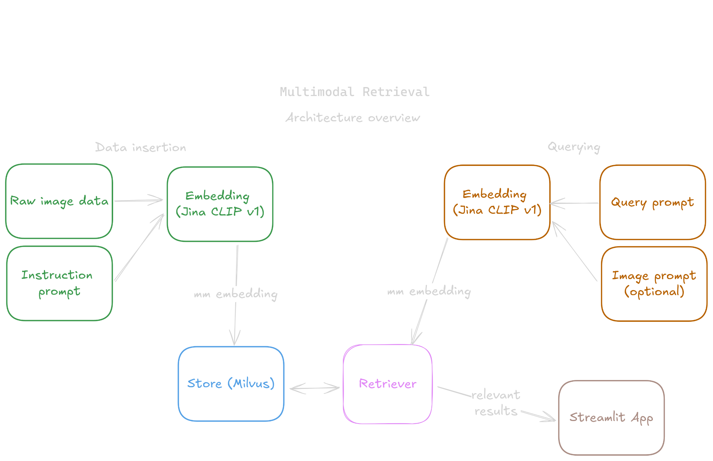
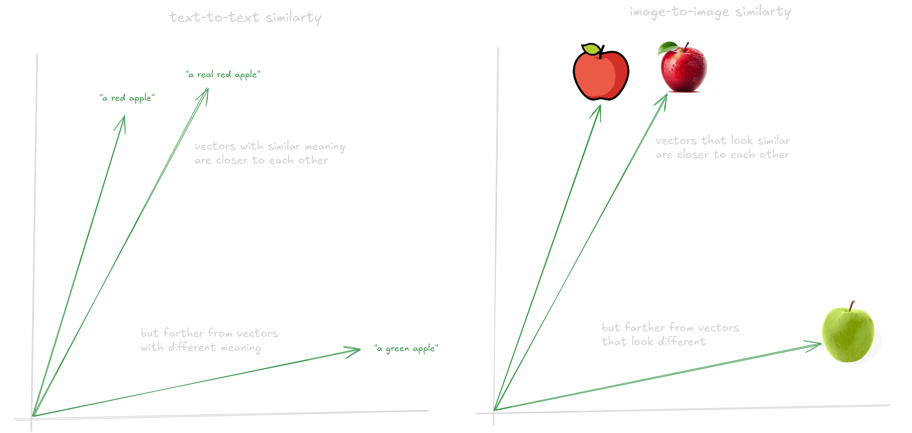
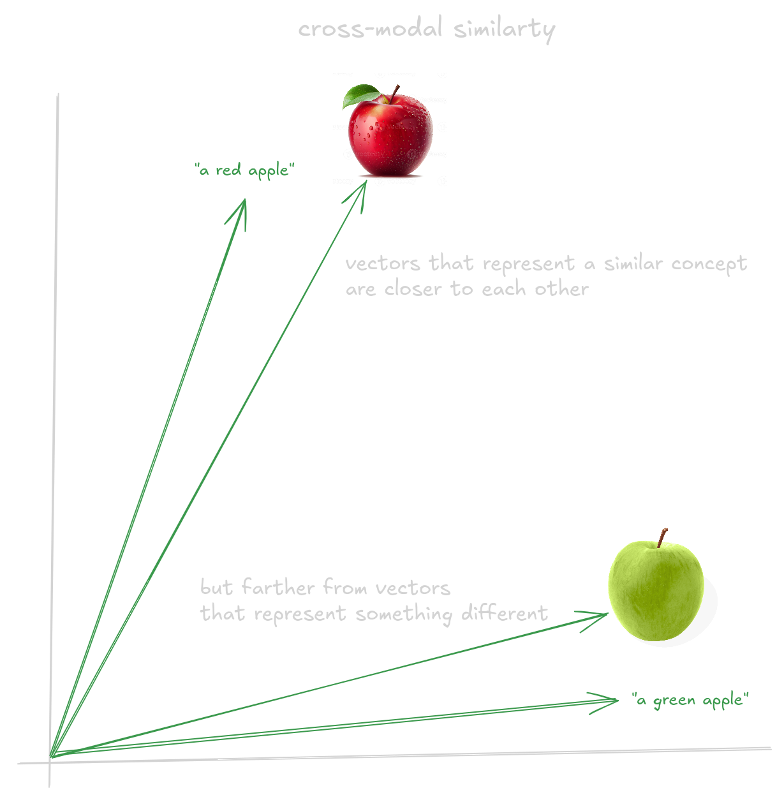

# SENTINEL Multimodal Retrieval

SENTINEL Multimodal Retrieval allows to search (retrieve) events, objects, situations or whatever that is happening in an image with simple natural language queries/prompts. This works for massive image datasets, which empowers the user to "just ask" and get relevant results within milliseconds.

This prototype leverages the power of multimodal vector spaces and models to represent both images and text into the same vector space, which allows for a unified and extremely fast vector search (via a vector database).

Demo video:

https://github.com/user-attachments/assets/df9adf12-e923-456c-9a8e-2b573dc3b7ec

### Architecture

This repository has four main modules:

- Multimodal embeddings (green, orange): This is the core part of this engine, the multimodal embeddings allow us to represent multiple modalities (text, images) into a joint vector space, which means that the vectors representing the image of a red cat, and the sentence "a red cat" will be close enough to get retrieved together. For this prototype, we are using the amazing [Jina CLIP v1 model](https://jina.ai/news/jina-clip-v1-a-truly-multimodal-embeddings-model-for-text-and-image/).
- Vector store (blue): A vector store based on the great [Milvus](https://github.com/milvus-io/milvus) vector database. This is a performance-critical module of the retrieval process, it is here where all the embeddings are stored, and it is Milvus the one that powers the super-fast similarity search features, the Retriever is built on top of this vector database.
- Retriever (purple): This module is in charge of the retrieve process, once a request is received, it starts by extracting the embeddings according to the modality of the query (text or image), and then prepares a vector similarity search to retrieve the more relevant (similar) objects to the query. It does not matter if the query was an image or a sentence, the retrieved results will be relevant.
- App (brown): A basic Streamlit app that allows the user to interact with the search engine in a "comfortable way", think of this module as a demo. However, the previous modules can be re-used in more complex scenarios.

<p align="center">
  
</p>

## The core idea behind this project

While this project could have been solved by using an image captioning model (image to text), then embedding the captions with a text embedding model (like BERT), and then retrieving the information based only on text, this is not the main idea of the project. The core idea here was to use ONE SINGLE model to embed both text and images, these type of models are called multimodal models, and allow us to work with different modalities without needing to use multiple models and embedding spaces.

The model we are using is called [Jina CLIP v1 model](https://jina.ai/news/jina-clip-v1-a-truly-multimodal-embeddings-model-for-text-and-image/), which is a CLIP-based model, trained to embed both texts and images into the same embedding space by aligning the text and image encodings.

Multimodal models allow us to "semantically" compare multiple modalities, which is a quite interesting and powerful idea. Some years ago, just the idea of comparing the embeddings of a "a green apple" and an actual image of a green apple and get a good similarity was almost impossible.

For example, the single-modality models are great at extracting meaningful embeddings from images and texts, but the embedding spaces generated by these models only work when comparing against embeddings from the same modality, the image below shows an example on how "similarity" works in these single-modality embedding spaces:

<p align="center">
  
</p>

As you can see, the vectors representing "similar concepts" are closer, while vectors representing a different concept are far. And the limitation here is that you can only compare an image with other images or a text with other texts.


But **multimodality** solves this limitation by aligning the embeddings, so the vector of a text that represent something similar to an image, will be closer to the vector of the image. These multi-modal vector spaces allow us to "semantically" compare texts to images, which is a really powerful capability. The image below illustrates how these models embed multi-modal data into the same vector space, and how this allow us to do cross-modal information retrieval.

<p align="center">
  
</p>

SENTINEL Multimodal Retrieval is built on top of this concept: embed images in a multimodal space, and retrieve them with both, text or image queries.

## Set up

With Docker, the set up is as easy as it gets, just clone the repository and then run: `docker compose up -d`

This will pull all the repositories and build the image. This will also launch the Streamlit app, which should be available at `http://localhost:8501/`

Since the vector database only stores absolute paths to the actual images (I will improve this for 2.x), you will need to mount the volumes where your data will be located, either by using the `docker-compose.yaml` file, or by creating a `docker-compose.override.yaml` file (recommended). The override file could contain something like:

```
services:
  sentinel-multimodal-retrieval:
    volumes:
      - "<absolute/path/to/your/data>:<absolute/path/to/your/data>"
```

## Usage

If the `docker compose up -d` ran correctly, everything must be working, you can check the Streamlit app on `http://localhost:8501/`. Obviously, you need to first insert some data into the vector database before being able to search.

#### Inserting data into Milvus
1. A basic script to insert data is implemented in `vector_store/insert_data.py`, which allows you to insert either a Flickr8k or a Flickr30k dataset into the Milvus collection. These datasets include images about different topics, and the datasets are easy to download and process.
2. Since the dependencies of this project are a big complex (will improve for 2.x), I strongly recommend to do everything from the docker container, for example, once you have run `docker compose up -d`, you can insert the data using the aforementioned script by just running: ```docker exec -it sentinel-multimodal-retrieval python3 -m vector_store.insert_data --data_type flickr8k --data_path <path-to-your-flickr8k-folder>```. Once this finishes, you will have the embeddings of the 8K images in the vector database, and you can start runnning some searches.
3. Go to `http://localhost:8501/`, and search anything, either by using a text query or an image related to the topic you want to search.

## Performance notes

I did some real basic testing to check the performance of the modules, so you have an idea on how fast this is.

### Text feature extraction

**CPU-only**

- os: pop-os 22.04
- inference hardware: 13th Gen Intel® Core™ i7-13650HX
- task: getting text embeddings from jina-clip-v1, using only CPU, for a sentence with 10 words

Results: `24.2 ms ± 1.72 ms per loop (mean ± std. dev. of 7 runs, 10 loops each)`

**GPU**

- os: pop-os 22.04
- inference hardware: NVIDIA GeForce RTX 4060 Laptop GPU
- task: getting text embeddings from jina-clip-v1, using only CPU, for a sentence with 10 words

Results: `6.52 ms ± 193 μs per loop (mean ± std. dev. of 7 runs, 100 loops each)`

### Image feature extraction

note: The feature extraction times include the pre-processing steps for the image (resizing, normalization, etc.)

**CPU-only**

- os: pop-os 22.04
- inference hardware: 13th Gen Intel® Core™ i7-13650HX
- task: getting image embeddings from jina-clip-v1, using the GPU, for an image of size 250x250

Results: `106 ms ± 226 μs per loop (mean ± std. dev. of 7 runs, 10 loops each)`

**GPU**

- os: pop-os 22.04
- inference hardware: NVIDIA GeForce RTX 4060 Laptop GPU
- task: getting image embeddings from jina-clip-v1, using the GPU, for an image of size 250x250

Results: `11.1 ms ± 63.9 μs per loop (mean ± std. dev. of 7 runs, 100 loops each)`

### Multimodal retrieval

**Text-to-image search**
- task: search with a query with 10 words, retrieve the top-20 kNN and return the hits
- vector_db: Milvus standalone v2.4.10
- search_space_size: Flickr30k, 31,796 images

Results: `9.53 ms ± 306 μs per loop (mean ± std. dev. of 7 runs, 100 loops each)`

Total search time - feature extraction time: `9.53 ms - 6.52 ms = 3.01 ms`

**Image-to-image search**
- task: search with a query image of size 250x250, retrieve the top-20 kNN and return the hits
- vector_db: Milvus standalone v2.4.10
- search_space_size: Flickr30k, 31,796 images

Results: `14 ms ± 237 μs per loop (mean ± std. dev. of 7 runs, 100 loops each)`

Total search time - feature extraction time: `14 ms - 11.1 ms = 2.9 ms`

## Roadmap for 2.x
The 2.x version of SENTINEL Multimodal Retrieval will include features such as:
- Reduced size and complexity of the project's dependencies, such as removing the need of using the Transformers library, and thus PyTorch.
- Implement a way to use ONNX models instead of torch-based models.


## Acknowledgments

- Thanks to [JinaAI](https://jina.ai/) for their amazing job on building foundations for retrieval systems and search engines. This project uses their [Jina CLIP v1 model](https://jina.ai/news/jina-clip-v1-a-truly-multimodal-embeddings-model-for-text-and-image/) to represent objects in a multimodal vector space.
- Thanks to [Milvus](https://github.com/milvus-io/milvus) for this great vector database open-source. Also thanks for the excellent documentation and set of tutorials you provide.
